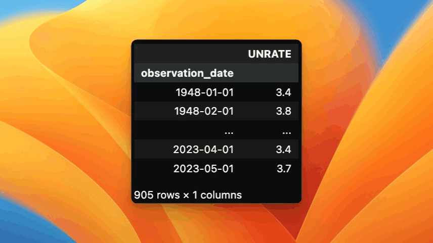

# 🔎 **FRED EDA Challenge: Unearth Hidden Treasures in Economic Data!**

# Table of Contents

- [Introduction](#introduction)
- [Instructions](#instructions)
  - [Install the Required Programs](#install-the-required-programs)
  - [Download \& Open the Exercises](#download--open-the-exercises)
  - [Working with the Materials](#working-with-the-materials)
    - [For Beginners](#for-beginners)
    - [For Advanced Learners](#for-advanced-learners)
- [Live Consulting Sessions](#live-consulting-sessions)
- [Go Beyond the Exercises](#go-beyond-the-exercises)
- [Context](#context)

## Introduction

Hello Aspiring Data Explorers,

Ever wondered how vast amounts of economic data can be transformed into meaningful insights? How charts and graphs can tell stories about economic trends, highs and lows, and pivotal turning points? 

We're excited to present the **FRED EDA Challenge** – a thrilling deep dive into the world of economic data exploration using Python's pandas and matplotlib libraries. 

FRED - the Federal Reserve Bank of St. Louis Economic Data - provides a gold mine of financial and economic data, a perfect playground for all data explorers. In this challenge, your task is to wield the power of data visualization to uncover patterns and extremes within the FRED data.

You'll be pinpointing the maximum and minimum values, revealing the hidden trends, and presenting your discoveries in a way that's easy to understand. Can you make a complex dataset understandable with a single graph? What insights can you extract from the peaks and troughs of economic indicators?

By accepting this challenge, you'll not only sharpen your Python coding skills but also learn how to ask the right questions of your data, perform comprehensive exploratory analysis, and effectively communicate your findings.

Whether you're new to data visualization or a seasoned pro, the FRED EDA Challenge promises a rich and rewarding exploration of real-world data. And who knows? You might be the one to unearth a critical insight that has the potential to influence economic understanding!

So, prepare your data visualization toolbox and accept the FRED EDA Challenge!

**Unleash your inner data explorer!**

## Instructions

### Install the Required Programs

For optimal engagement with this exercise, you should install Python and Jupyter Lab. Please follow the step-by-step instructions in [this series of short tutorials](https://www.youtube.com/playlist?list=PL8HtbO24Pl3iVcMUyuaxl7T9henX83ZOm) to ensure a proper setup.

### Download & Open the Exercises

1. Download the files from [this repository](https://github.com/jsulopzs/FRED-Analysis).
2. Open the exercises following the steps of the tutorial:

<iframe src="https://www.loom.com/embed/d48a715a8f7f4c7b95343c01d3cf3a75?sid=4b8cedb9-f73c-43a1-b2b3-f6040a6d6b4c" frameborder="0" webkitallowfullscreen mozallowfullscreen allowfullscreen style="position: absolute; top: 0; left: 0; width: 100%; height: 100%;"></iframe>

### Working with the Materials

This challenge involves two Jupyter notebooks:

1. [`01A_EDA.ipynb`](01A_EDA.ipynb)
2. [`01B_EDA.ipynb`](01B_EDA.ipynb)

#### For Beginners

If you are beginning your journey with data visualization, start with notebook [`01A_EDA.ipynb`](01A_EDA.ipynb). This notebook contains a series of blank cells where you'll write your Python code, along with examples of the output you should aim to achieve. Use these outputs as a guideline for what your visualizations and analyses should look like.

Feeling stuck? Don't worry! As a beginner, you can always access premium support by purchasing our specifically designed course for newbies in data analysis and visualization. This course is available with the [Datons Academy's subscription](https://stories.datons.ai/early-adopters-1). By purchasing this subscription, you'll gain access to comprehensive learning materials and dedicated support, designed to guide you through your data science journey.

#### For Advanced Learners

If you are more advanced and up for a challenge, notebook [`01B_EDA.ipynb`](01B_EDA.ipynb) is for you. This notebook provides only the titles of the exercises, leaving you complete freedom to decide how to approach and solve each task. This is your chance to get creative with your solutions!

## Live Consulting Sessions

Remember, if you purchase [Datons Academy's subscription](https://stories.datons.ai/early-adopters-1), you'll be able to attend live consulting sessions. These sessions are a fantastic opportunity to resolve any doubts, interact with experts, gain professional guidance, and explore new lines of code. Boost your programming skills and unlock a deeper understanding of data science!

## Go Beyond the Exercises

While we have constrained the exercises to specific outputs, don't let that limit you. We encourage all participants to think outside the box. Can you create a different visualization that offers more insight? Can you find a novel way to analyze the data?

Remember, data science is not just about following instructions—it's about asking interesting questions, exploring data in new ways, and finding insights that others might miss.

**Happy data exploration!**

## Context

The Federal Reserve Economic Data (FRED) is a database maintained by the Federal Reserve Bank of St. Louis. It is an extensive collection of economic and financial data, which includes interest rates, GDP, employment and unemployment rates, consumer price indices, and more. It contains over 800,000 data series from dozens of national, international, public, and private sources.

As a data science learner, FRED can be a very valuable resource for a few reasons:

1. **Data Variety**: FRED contains a wide array of data that cuts across various sectors of the economy. This gives you an opportunity to work with diverse data sets, understand various economic indicators, and how they might interrelate.

2. **Data Quality**: The data on FRED are curated from reliable sources, meaning you can trust the quality of the data you're working with. This allows you to focus more on the analysis rather than cleaning and processing the data.

3. **Accessibility**: FRED provides multiple ways to access its data. You can manually download data series from the FRED website in formats like CSV, which you can then read into a Python program using pandas. Also, you could use the FRED API to programmatically download data. There are Python libraries like `fredapi` that provide easy-to-use interfaces to the FRED API.

4. **Free of Charge**: All of the data available on FRED can be accessed free of charge. This makes it a great resource for students and those who are just starting out in data science.

5. **Learning Resource**: Alongside its data, FRED provides a lot of explanatory notes and resources about the data series it provides. This can be a great learning resource to understand the economic concepts behind the data.

In summary, FRED is a fantastic resource for anyone learning data science, offering a broad collection of high-quality, accessible, and diverse data sets for analysis and modeling. Whether you're interested in macroeconomic trends, finance, or economic research, FRED can provide the data you need.